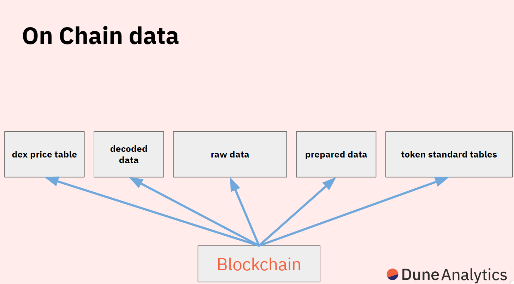

# ts Dune Demo

## Description

This project is a exploration of how we can utilise Dune or any other Data analysis software to explore public blockchains

## Installation

This project uses virtualenv for managing dependencies. Follow the steps below to set up the project on your local machine.

1. Ensure you have Python installed on your machine. You can verify this by running `python --version` in your terminal. If you don't have Python installed, you can download it from the [official website](https://www.python.org/downloads/).

2. Install virtualenv if you haven't already, you can do this by running `pip install virtualenv`.

3. Navigate to the project directory and create a virtual environment by running `virtualenv venv`.

4. Activate the virtual environment. On Windows, run `.\venv\Scripts\activate`. On Unix or MacOS, run `source venv/bin/activate`.

5. Install the project dependencies by running `pip install -r requirements.txt`.

6. Go to [Dune Analytics](https://dune.com/home) and setup a API key

7. Create a file called `.env` file in the root of the project and set a variable `DUNE_API_KEY` with the API key generated in .6

Now you're all set to run the project!

## Usage

Open dashboard notebook 
